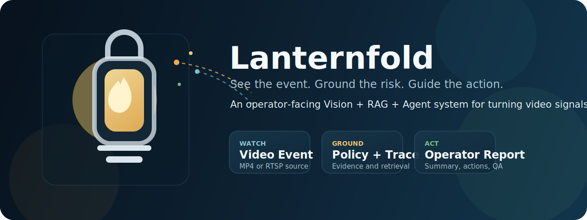
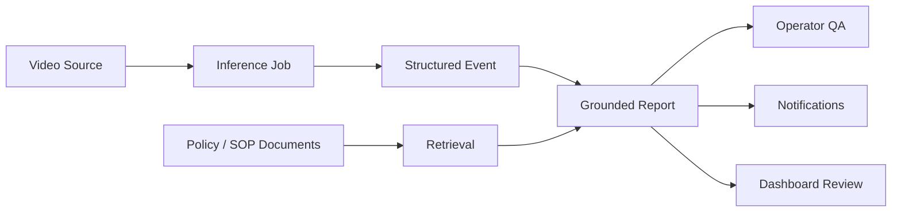

<p align="center">
  
</p>

<h1 align="center">Lanternfold</h1>

<p align="center">
  <strong>An operator-facing Vision + RAG + Agent platform for turning video events into grounded decisions.</strong>
</p>

<p align="center">
  Lanternfold is the public repository name. <code>EventOps</code> is the working product name used inside the codebase and internal docs.
</p>

<p align="center">
  
  
  
  
  
</p>

---

## What is Lanternfold?

Lanternfold is a system that helps operators answer three practical questions when something unusual appears in a video feed:

1. What happened?
2. Why does it matter?
3. What should we do next?

Instead of stopping at "an event was detected," Lanternfold tries to connect the full chain:

- video signal
- structured event
- policy grounding
- operator report
- review and action

That is the core idea of the project.

## Why this project exists

A lot of Vision AI demos end with bounding boxes, labels, and confidence scores.
Real operations work does not.

In a real control room, warehouse, plant, or safety desk, the important part is what comes after detection:

- Is this event actually high risk?
- Which rule or SOP applies here?
- What is the first action an operator should take?
- Can we show evidence and reasoning, not just a model output?

Lanternfold is built to demonstrate that "detection" is only the first step.
The real product value is in turning that signal into an evidence-backed operational decision.

## What you can demo today

The current MVP can already do the following:

- Upload an MP4 video source
- Register an RTSP source
- Create a deterministic inference job
- Store events, evidence, and raw detections
- Upload SOP or policy documents
- Search grounded policy chunks
- Generate an operator report with summary, risk, citations, and actions
- Ask event-grounded QA questions
- Save review status and operator feedback
- View the workflow in a dashboard
- Export Prometheus metrics

## How Lanternfold works



In plain English:

1. A video source is uploaded or registered.
2. The system creates a structured event.
3. Related policy documents are searched.
4. A grounded report is generated.
5. The operator reviews the event, asks questions, and decides what to do.

## What is real today, and what is still a demo layer?

This repository is intentionally built as a runnable MVP.
That means some parts are production-shaped, while others are demo adapters that keep the whole stack easy to run locally.

### Production-shaped parts

- FastAPI API surface
- Event storage model
- Document ingestion and chunking
- Operator report and QA workflow
- Dashboard pages
- Metrics, logs, Docker, and tests

### Demo-friendly parts

- Vision inference is a deterministic adapter, not a real detector yet
- Retrieval is lexical, not vector search yet
- Notifications are recorded in-app rather than sent to Slack or Telegram by default
- The report generator is a grounded heuristic workflow, not a full external LLM serving stack

This is deliberate: the repository proves the end-to-end product flow first, then leaves clean seams for swapping in real detectors, vector databases, and model serving later.

## Quick start

### 1. Start Docker Desktop

Make sure Docker is running.

### 2. Launch the app

From the repository root:

```powershell
docker compose -f infra/docker/docker-compose.yml up --build
```

### 3. Open the app

- Dashboard: `http://localhost:8000`
- API docs: `http://localhost:8000/docs`
- Health check: `http://localhost:8000/healthz`
- Metrics: `http://localhost:8000/metrics`

## Two-minute local flow

If you want the shortest path to understanding the project:

1. Open the dashboard.
2. Upload the sample SOP flow or your own Markdown policy.
3. Upload an MP4 file with a name like `fall_demo.mp4`.
4. Run inference.
5. Open the event page.
6. Generate a report.
7. Ask: `Why is this event high risk?`
8. Save a review decision.

## Main API endpoints

- `POST /api/v1/sources/files`
- `POST /api/v1/sources/rtsp`
- `GET /api/v1/sources`
- `POST /api/v1/inference/jobs`
- `GET /api/v1/inference/jobs/{job_id}`
- `GET /api/v1/events`
- `GET /api/v1/events/{event_id}`
- `PATCH /api/v1/events/{event_id}`
- `POST /api/v1/documents`
- `GET /api/v1/documents/search`
- `POST /api/v1/reports/generate`
- `POST /api/v1/qa`
- `GET /api/v1/metrics/summary`

If you prefer exploring interactively, start with `http://localhost:8000/docs`.

## Repository map

```text
services/
  api-gateway/      Main FastAPI app, UI routes, event/report/QA logic
  vision-service/   Placeholder boundary for future detector extraction
  agent-service/    Placeholder boundary for future agent extraction
  frontend/         Placeholder boundary for future dedicated frontend work
libs/
  prompts/          Prompt and behavior references
  eval/             Golden cases and evaluation assets
  schemas/          Shared schema notes
infra/
  docker/           Dockerfile and docker-compose
  k8s/              Kubernetes manifests
  monitoring/       Prometheus config
datasets/
  documents/        Sample safety SOP document
docs/               Project docs and deep dives
```

## Important docs

If you are new to the repo, read these in order:

- [PROJECT_EXPLAINED_FOR_EVERYONE](docs/PROJECT_EXPLAINED_FOR_EVERYONE.md)
- [SYSTEM_ARCHITECTURE_GUIDE](docs/SYSTEM_ARCHITECTURE_GUIDE.md)
- [IMPLEMENTATION_LOGIC_DETAIL](docs/IMPLEMENTATION_LOGIC_DETAIL.md)
- [MVP_SPEC](docs/MVP_SPEC.md)
- [ARCHITECTURE](docs/ARCHITECTURE.md)

Note: the deeper project documents are currently written in Korean.

## Testing

Run the full test suite:

```powershell
docker compose -f infra/docker/docker-compose.yml run --rm api pytest
```

Run a focused workflow test:

```powershell
docker compose -f infra/docker/docker-compose.yml run --rm api pytest services/api-gateway/tests/test_event_workflow.py
```

## Configuration

Main environment variables:

- `EVENTOPS_DATABASE_URL`
- `EVENTOPS_STORAGE_ROOT`
- `EVENTOPS_SEED_SAMPLE_DATA`
- `EVENTOPS_NOTIFICATION_MODE`
- `EVENTOPS_NOTIFICATION_TARGET`
- `EVENTOPS_API_TOKEN`

If `EVENTOPS_API_TOKEN` is set, all `/api/*` routes require an `x-api-token` header.

## What is already verified

The current Docker-based verification covers:

- document upload
- video upload
- inference job creation
- event listing and detail lookup
- grounded report generation
- operator QA
- dashboard rendering
- Prometheus metrics
- legacy SQLite schema compatibility at boot

## Design choices worth knowing

- Events and raw detections are stored separately.
- High-risk events are guarded so they are not produced without evidence.
- Report actions are extracted from the original uploaded policy sections when action headings and bullet lists are available.
- The app upgrades older SQLite inference schemas by adding the `threshold` column at boot if needed.
- The current architecture is a modular monolith on purpose, to keep local verification simple while preserving future extraction boundaries.

## What comes next

Natural upgrade paths from this MVP are:

- Vision -> YOLO / RF-DETR / ONNX Runtime
- Retrieval -> pgvector / Qdrant
- Report generation -> external LLM / agent orchestration
- Notifications -> real Slack / Telegram delivery
- Database -> PostgreSQL
- Storage -> object storage

## The short version

Lanternfold is not just a "video event detector."
It is a system for turning video events into operator-facing, evidence-backed decisions.
