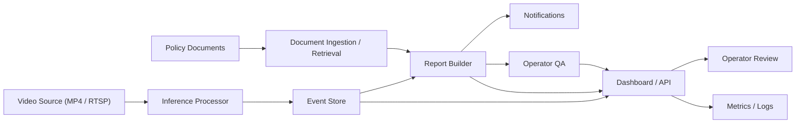

# EventOps 아키텍처와 모듈 역할 문서

## 개요

현재 EventOps MVP는 하나의 FastAPI 애플리케이션 안에 여러 경계를 나눈 `modular monolith` 형태로 구현되어 있습니다.
즉, 배포는 하나이지만 역할은 분리되어 있습니다.

현재 구조의 장점은 다음과 같습니다.

- Docker로 빠르게 재현 가능하다.
- PRD의 end-to-end 흐름을 한 번에 검증할 수 있다.
- 나중에 `vision`, `agent`, `knowledge`를 독립 서비스로 분리하기 쉽다.

## 전체 흐름

## 주요 계층

### 1. Source Layer

역할:

- MP4 파일 업로드를 받는다.
- RTSP source 등록을 받는다.
- source 메타데이터를 저장한다.

핵심 책임:

- `source_id` 발급
- 파일 저장 경로 관리
- source 타입 구분 (`file`, `rtsp`)

관련 API:

- `POST /api/v1/sources/files`
- `POST /api/v1/sources/rtsp`
- `GET /api/v1/sources`

### 2. Inference Processor

역할:

- source를 입력으로 받아 이벤트를 만든다.

현재 구현:

- 파일명 기반의 deterministic demo detector
- 예: `fall_demo.mp4` -> `fall`

핵심 책임:

- inference job 생성
- raw detection 저장
- logical event 생성
- evidence 저장
- threshold 기록

관련 API:

- `POST /api/v1/inference/jobs`
- `GET /api/v1/inference/jobs/{job_id}`

### 3. Event Store

역할:

- 추론 결과를 운영자가 다룰 수 있는 이벤트 단위로 저장한다.

핵심 책임:

- raw detection과 logical event 분리
- risk level 저장
- review status 저장
- operator feedback 저장
- evidence, report, trace, notification, query 연결

핵심 엔터티:

- `video_sources`
- `inference_jobs`
- `raw_detections`
- `events`
- `event_evidence`
- `agent_reports`
- `agent_traces`
- `operator_queries`
- `notifications`

관련 API:

- `GET /api/v1/events`
- `GET /api/v1/events/{event_id}`
- `PATCH /api/v1/events/{event_id}`

### 4. Knowledge Layer

역할:

- 안전 규정, SOP, 매뉴얼을 검색 가능한 형태로 바꾼다.

현재 구현:

- Markdown/PDF ingestion
- text chunking
- lexical retrieval

핵심 책임:

- 문서 업로드 및 저장
- 텍스트 추출
- chunk 생성
- retrieval API 제공

관련 API:

- `POST /api/v1/documents`
- `GET /api/v1/documents`
- `GET /api/v1/documents/search`

### 5. Agent / Report Layer

역할:

- 이벤트와 문서를 함께 보고 운영자용 리포트를 만든다.

현재 구현:

- heuristic grounded agent
- evidence 기반 risk 판단
- citation 기반 summary / actions / trace 생성

핵심 책임:

- event 로드
- evidence 확인
- policy retrieval
- summary 생성
- risk reason 생성
- recommended actions 생성
- trace 저장
- notification 생성

관련 API:

- `POST /api/v1/reports/generate`

### 6. Operator QA Layer

역할:

- 운영자가 자연어 질문으로 이벤트를 묻고 답을 받게 한다.

핵심 책임:

- event-grounded answer 생성
- policy citation 첨부
- recent similar event count 응답
- question/answer 기록 저장

관련 API:

- `POST /api/v1/qa`

### 7. Dashboard / UI Layer

역할:

- 운영자가 source, event, report를 보는 화면을 제공한다.

현재 구현:

- server-rendered HTML
- source upload form
- document upload form
- source list
- event list
- event detail
- review form
- QA form

주요 화면:

- `/`
- `/events/{event_id}`

### 8. Observability / Security Layer

역할:

- 시스템 상태를 추적하고 기본 보안을 제공한다.

현재 구현:

- structured logging
- Prometheus metrics
- optional API token auth
- schema compatibility bootstrap

관련 엔드포인트:

- `GET /healthz`
- `GET /metrics`
- `GET /api/v1/metrics/summary`

## 모듈별 책임 분리 요약

### API Boundary

- HTTP 입출력 처리
- request validation
- response serialization

### Vision Boundary

- 이벤트 타입 식별
- confidence 부여
- raw detection/evidence 생성

### Knowledge Boundary

- 문서 저장
- chunk 생성
- 검색 결과 반환

### Agent Boundary

- event + policy 결합
- grounded summary 생성
- action recommendation 생성
- trace/notification 생성

### UI Boundary

- 운영자 상호작용
- review/QA 입력
- 상태 확인

## 현재 배포 구조

현재는 다음처럼 하나의 서비스로 실행됩니다.

- FastAPI app
- SQLite
- 로컬 파일 스토리지
- Docker Compose

이 구조는 MVP 검증에 적합합니다.

## 향후 분리 가능한 구조

PRD 기준으로 이후 분리 지점은 명확합니다.

- `services/vision-service`
- `services/agent-service`
- vector DB (`pgvector` 또는 `Qdrant`)
- queue (`Celery` 또는 `RQ`)
- object storage (`MinIO` 등)

즉, 현재 구조는 작게 시작하되 나중에 확장할 수 있는 형태입니다.

## 이 아키텍처의 핵심 메시지

이 프로젝트의 아키텍처는 "모델 하나"가 아니라 "운영 시스템 하나"를 보여주기 위한 구조입니다.

핵심은 다음 한 문장으로 정리할 수 있습니다.

"영상 이벤트를 감지하고, 문서 근거를 찾고, 운영자 행동으로 연결하는 전 과정을 한 흐름으로 묶는 구조"
